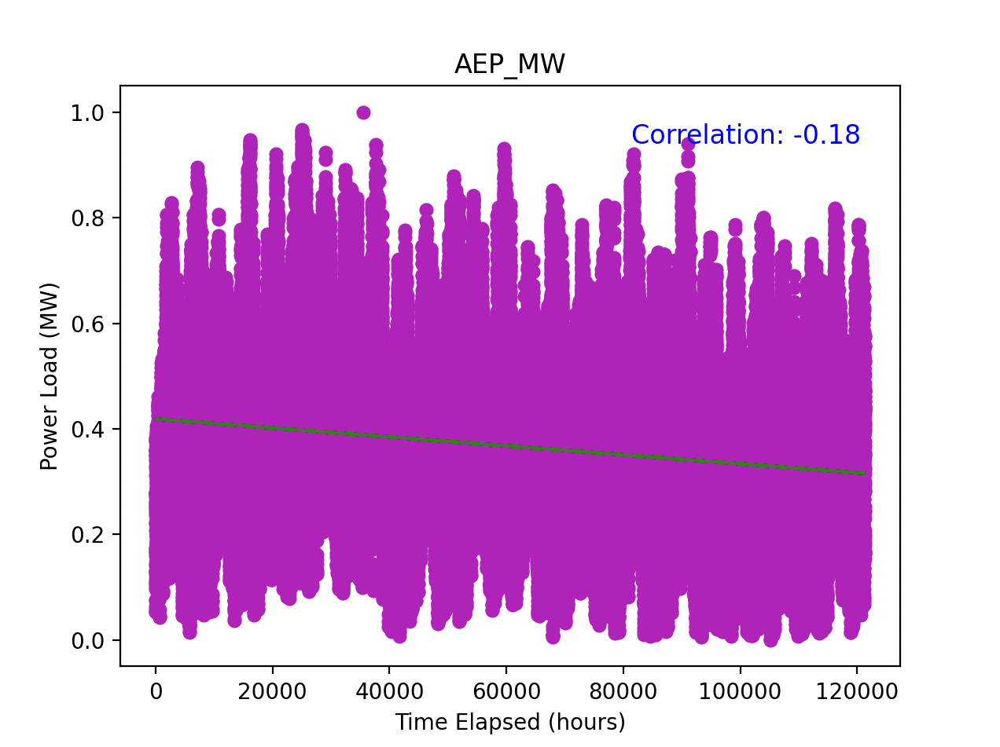

# Project Proposal

**Author Names**: Graham Hill, Tanner Iley, Rhea Jaxon, Pranav Jothi, Justin Kamina

## Introduction and Background

With constantly rising inflation rates striking the United States’ economy, our project aims to utilize machine learning concepts in order to understand better resource management towards sustainability efforts.

After conducting a literature review, we have researched past techniques and attempts of similar projects in order to refine our idea into a substantial foundation. A study about predictive energy consumption specifically in the residential perspective utilized algorithms like linear regression, random forests, and support vector regression to capture the complex relationships in predictive analysis [3]. However, some downfalls of this study were the lack of real-time data and limited scope of geographical area/time frame. Because of this, our group is broadening our dataset to the entire Eastern region of the U.S. with hourly data of the previous decade. Additional journals [1][2] also provide similar feedback on the machine learning processes we should look at for smart homes and industrial/urban environments, respectively. The pitfalls of such type of research in the past seem to be largely focused on data limitations and finding the right balance of machine learning algorithms to achieve complexity and interpretability of data.

## Data Set Description and Link

The dataset we are currently focusing on is a 14-year hourly report of energy consumption in the Eastern interconnection grid from PJM Interconnection LLC covering Delaware, Illinois, Indiana, Kentucky, Maryland, Michigan, New Jersey, North Carolina, Ohio, Pennsylvania, Tennessee, Virginia, West Virginia, and the District of Columbia.

The features we are looking at currently are going to be time, geographical location, and weather to predict future energy consumption from past records.

[Link to dataset](https://www.kaggle.com/datasets/robikscube/hourly-energy-consumption)

## Problem Definition

Driven by increasing population and, ultimately, demand, the United States faces a growing pressure to accommodate their population energy consumption needs effectively. Developing a predictive model from decades worth of energy consumption data can help build a better understanding on consumption trends and how smart technology and household behavior can utilize these forecasts for a cheaper and more sustainable environment in America.

## Methods

For our project, we've decided on the following methods for our data preprocessing: **Data Cleaning, Data Transformation, Feature Selection**.

- **Data Cleaning**
  - Data Cleaning is critical for producing data that is suitable for model training. This can involve removing outlier/irrelevant data points from our dataset, replacing missing values with mean, median, or mode, as well as fixing overall data entry.

- **Data Transformation**
  - Includes normalization/standardization/logarithmic transformations.
  - Covers nearly all possible distribution cases.

- **Feature Selection**
  - Includes normalization/standardization/logarithmic transformations.
  - Covers nearly all possible distribution cases.

For our project, we decided on the following machine learning methods: **K Nearest Neighbors (supervised), Random Forest (supervised), and Linear/Logistic Regression (supervised)**.

- **K Nearest Neighbors (KNN)**
  - Tests if energy model predictions match historical data.
  - Validates correlation between energy habits and energy consumption.

- **Random Forest (RF) Model**
  - Handles non-linear relationships in data.
  - Considers factors like day of the week and weather.
  - Creates decision trees to determine energy consumption habits.

- **Linear Regression (LR) Modeling**
  - Identifies strong correlations between energy habits and overall energy consumption.
  - Uses numerical data to test for positive correlation with energy consumption.

## Potential Results and Discussion

For our project, we must select one metric suitable for Clustering and two metrics suitable for regression so that the metrics properly evaluate the methods. Therefore, we settled on **Adjusted Mutual Info Score (KNN), Mean Absolute Error (RF), and Root Mean Squared Error (LR)**. We chose these metrics because they align with our goals for this project. Recently, energy prices have risen massively and are becoming more of a burden on the working class of America. We hope this project sheds some light on where the average home can sustainably cut back on energy usage. We expect power usage to be moderately lower in places like North Carolina than places like Illinois because of the difference in heating and cooling needs.

### Midterm Checkpoint

## Visualization and Quantitative Metrics

The first model we chose to implement was the linear regression model. We decided to implement this model as it would give us better understanding of how different factors could connect to energy use. The visualization created from this implementation was a scatter plot, which showcases the relationship between time elapsed (independent variable) to the power load in MW (dependent variable). The points on the scatterplot represent the preprocessed data of 14 years worth of hourly measurements in the Eastern Interconnection grid. The green linear regression fit line is seen as having a slight negative linear progression. As described in our code, we calculated the correlation coefficient, which is also displayed on our visual as -0.18. This statistic suggests that the relationship between power load and time elapsed is a negative weak correlation. 

## Analysis

**Correlation**: -0.18 as the correlation coefficient suggests a weak negative relationship between the two variables, time and power load. This means that there is no strong evidence to imply that over time there was a slight decrease in power load in the duration of the 14 years. 

**Regression Line**: Looking at the scatterplot as a whole, there is a high level of variance amongst the points over the 14 year period. Because of this high level of variance, the slight decrease from the relationship of these two variables might not be a strong indicator of the true change over time. 

Our linear regression model did not give us a strong indicator of the relationship between time and power load. Due to a relatively small correlation coefficient value and almost flat trend line, we could not observe significant patterns to identify due to some of the potential factors listed below.

- **One Feature**: As we were not able to conclude a significant trend, it is clear that time alone is insufficient as a predictor. As suggested in our proposal, we need to look at other variables, such as weather conditions, day of the week, and geographical location. These other potential features might have a stronger correlation to power load.

- **High Variability**: The scatterplot describes a high variability in power load throughout the years. We would need to try incorporating other features, which could indicate why there is such a high level of variability and what features could reduce this.

- **Seasonal Patterns**: A linear regression model may not be able to effectively capture cyclical patterns, which may be what is happening with the power load trends on an annual basis. Exploring other modeling options, such as a time-series model with seasonal decomposition could perform better.

## Next Steps

For future iterations of our project, we came up with a list of potential improvements we can make to our models and factors to consider for other models we will work on for this project. Based on our analysis of the linear regression model, we came up with these next steps:

- **Additional Features**: Incorporate other features such as temperature, day of the week, and geographical location to capture more complex relationships.

- **Explore Alternatives**: Explore other ML models that may more effectively interpret the data we want to learn about. Some models we were looking at include: Random Forests, which can capture non-linear relationships, or time-series models that can account for seasons.

- **Other Metrics**: Calculate metrics such as Mean Absolute Error (MAE) or Root Mean Squared Error (RMSE) to quantify the prediction error more accurately.

## Gantt Chart

<iframe src="https://docs.google.com/spreadsheets/d/e/2PACX-1vQhmutOs0rWWG6KI8WY2ifHFISfltkbkcG-NgWRFObkjI6fjk4zgbMejmJ_67K-EQ/pubhtml?widget=true&headers=false" width="100%" height="500"></iframe>

## References

1. A. Bashir, et al., "Predicting Energy Consumption in Smart Buildings: A Machine Learning Approach," Energy Reports, vol. 7, pp. 282-293, 2021.
2. H. Cheng, et al., "Data-Driven Approaches for Predicting Energy Consumption in Urban Environments," Renewable and Sustainable Energy Reviews, vol. 151, 111550, 2022.
3. Y. Fang, et al., "A Machine Learning Approach for Energy Consumption Prediction in Smart Homes," Energy and Buildings, vol. 202, pp. 109-119, 2019.

