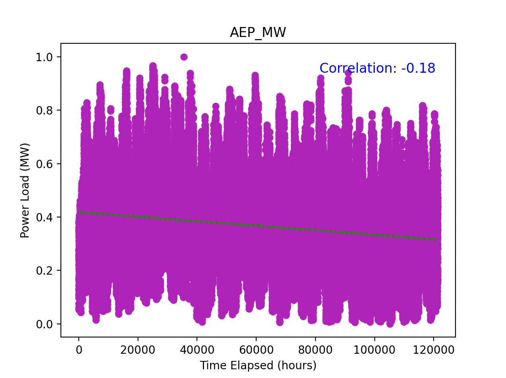
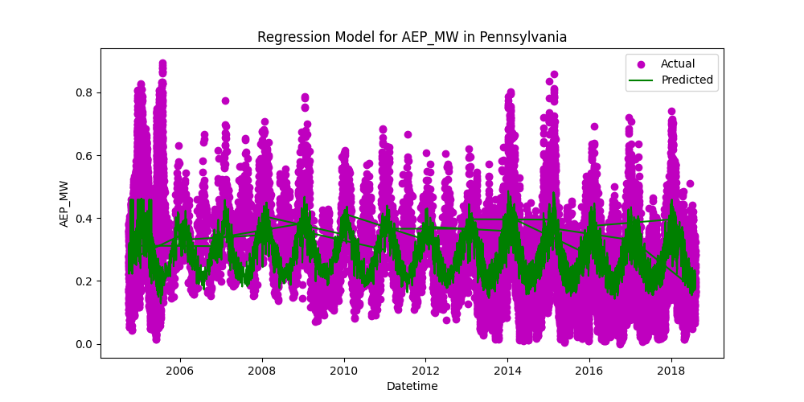
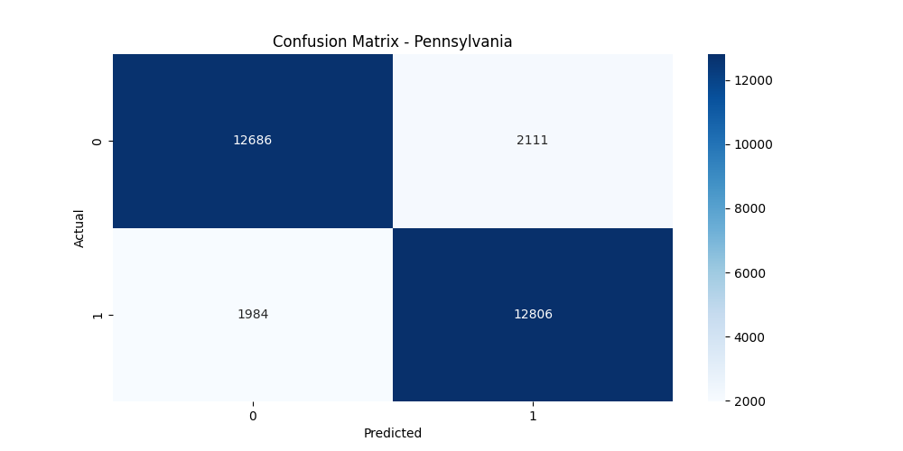
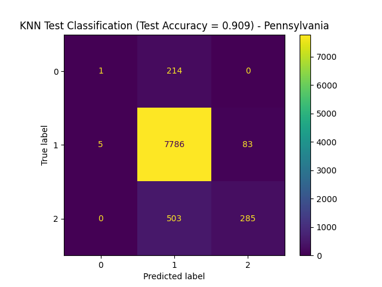

# Final Report

**Author Names**: Graham Hill, Tanner Iley, Rhea Jaxon, Pranav Jothi, Justin Kamina

## Introduction and Background

With constantly rising inflation rates striking the United States’ economy, our project aims to utilize machine learning concepts in order to understand better resource management towards sustainability efforts.

After conducting a literature review, we have researched past techniques and attempts of similar projects in order to refine our idea into a substantial foundation. A study about predictive energy consumption specifically in the residential perspective utilized algorithms like linear regression, random forests, and support vector regression to capture the complex relationships in predictive analysis [3]. However, some downfalls of this study were the lack of real-time data and limited scope of geographical area/time frame. Because of this, our group is broadening our dataset to the entire Eastern region of the U.S. with hourly data of the previous decade. Additional journals [1][2] also provide similar feedback on the machine learning processes we should look at for smart homes and industrial/urban environments, respectively. The pitfalls of such type of research in the past seem to be largely focused on data limitations and finding the right balance of machine learning algorithms to achieve complexity and interpretability of data.

## Data Set Description and Link

The dataset we are currently focusing on is a 14-year hourly report of energy consumption in the Eastern interconnection grid from PJM Interconnection LLC covering Delaware, Illinois, Indiana, Kentucky, Maryland, Michigan, New Jersey, North Carolina, Ohio, Pennsylvania, Tennessee, Virginia, West Virginia, and the District of Columbia.

The features we are looking at currently are going to be time, geographical location, and weather to predict future energy consumption from past records.

[Link to dataset](https://www.kaggle.com/datasets/robikscube/hourly-energy-consumption)

[Link to climate data](https://www.ncei.noaa.gov/maps/hourly/).

## Problem Definition

Driven by increasing population and, ultimately, demand, the United States faces a growing pressure to accommodate their population energy consumption needs effectively. Developing a predictive model from decades worth of energy consumption data can help build a better understanding on consumption trends and how smart technology and household behavior can utilize these forecasts for a cheaper and more sustainable environment in America.

## Methods

For our project, we've decided on the following methods for our data preprocessing: **Data Cleaning, Data Transformation, Feature Selection**.

- **Data Cleaning**
  - Data Cleaning is critical for producing data that is suitable for model training. This can involve removing outlier/irrelevant data points from our dataset, replacing missing values with mean, median, or mode, as well as fixing overall data entry.

- **Data Transformation**
  - Includes normalization/standardization/logarithmic transformations.
  - Covers nearly all possible distribution cases.

- **Feature Selection**
  - Includes normalization/standardization/logarithmic transformations.
  - Covers nearly all possible distribution cases.

For our project, we decided on the following machine learning methods: **K Nearest Neighbors (supervised), Random Forest (supervised), and Linear/Logistic Regression (supervised)**.

- **K Nearest Neighbors (KNN)**
  - Tests if energy model predictions match historical data.
  - Validates correlation between energy habits and energy consumption.

- **Random Forest (RF) Model**
  - Handles non-linear relationships in data.
  - Considers factors like day of the week and weather.
  - Creates decision trees to determine energy consumption habits.

- **Linear Regression (LR) Modeling**
  - Identifies strong correlations between energy habits and overall energy consumption.
  - Uses numerical data to test for positive correlation with energy consumption.

## Potential Results and Discussion

For our project, we must select one metric suitable for Clustering and two metrics suitable for regression so that the metrics properly evaluate the methods. Therefore, we settled on **Adjusted Mutual Info Score (KNN), Mean Absolute Error (RF), and Root Mean Squared Error (LR)**. We chose these metrics because they align with our goals for this project. Recently, energy prices have risen massively and are becoming more of a burden on the working class of America. We hope this project sheds some light on where the average home can sustainably cut back on energy usage. We expect power usage to be moderately lower in places like North Carolina than places like Illinois because of the difference in heating and cooling needs.

## Data Pre-Processing

For pre-processing, we chose to clean and normalize the data. Cleaning helps remove inconsistencies, outliers, or missing values that could lead to misleading insights, while normalization scales the data into a consistent range, making it easier for machine learning algorithms to converge and improve accuracy. Our goal with these steps was to feed accurate data effectively into the model for results that are easy to interpret.

## Linear Regression

### Visualization and Quantitative Metrics

The first model we chose to implement was the linear regression model. We decided to implement this model as it would give us better understanding of how different factors could connect to energy use. Linear Regression gives a better idea on what trends occur in our data. The visualization created from this implementation was a scatter plot, which showcases the relationship between time elapsed (independent variable) to the power load in MW (dependent variable). The points on the scatterplot represent the preprocessed data of 14 years worth of hourly measurements in the Eastern Interconnection grid. The green linear regression fit line is seen as having a slight negative linear progression. As described in our code, we calculated the correlation coefficient, which is also displayed on our visual as -0.18. This statistic suggests that the relationship between power load and time elapsed is a negative weak correlation. 

### Midterm Checkpoint Visualization

### Midterm Analysis

**Correlation**: -0.18 as the correlation coefficient suggests a weak negative relationship between the two variables, time and power load. This means that there is no strong evidence to imply that over time there was a slight decrease in power load in the duration of the 14 years. 

**Regression Line**: Looking at the scatterplot as a whole, there is a high level of variance amongst the points over the 14 year period. Because of this high level of variance, the slight decrease from the relationship of these two variables might not be a strong indicator of the true change over time. 

Our linear regression model did not give us a strong indicator of the relationship between time and power load. Due to a relatively small correlation coefficient value and almost flat trend line, we could not observe significant patterns to identify due to some of the potential factors listed below.

- **One Feature**: As we were not able to conclude a significant trend, it is clear that time alone is insufficient as a predictor. As suggested in our proposal, we need to look at other variables, such as weather conditions, day of the week, and geographical location. These other potential features might have a stronger correlation to power load.

- **High Variability**: The scatterplot describes a high variability in power load throughout the years. We would need to try incorporating other features, which could indicate why there is such a high level of variability and what features could reduce this.

- **Seasonal Patterns**: A linear regression model may not be able to effectively capture cyclical patterns, which may be what is happening with the power load trends on an annual basis. Exploring other modeling options, such as a time-series model with seasonal decomposition could perform better.

### Next Steps

For future iterations of our project, we came up with a list of potential improvements we can make to our models and factors to consider for other models we will work on for this project. Based on our analysis of the linear regression model, we came up with these next steps:

- **Additional Features**: Incorporate other features such as temperature, day of the week, and geographical location to capture more complex relationships.

- **Explore Alternatives**: Explore other ML models that may more effectively interpret the data we want to learn about. Some models we were looking at include: Random Forests, which can capture non-linear relationships, or time-series models that can account for seasons.

- **Other Metrics**: Calculate metrics such as Mean Absolute Error (MAE) or Root Mean Squared Error (RMSE) to quantify the prediction error more accurately.

### Updates

Between the midterm checkpoint and final report, we changed the structure of the linear regression model. We changed the independent variable of the model from solely time to climate data and time. Additionally, since the climate data was separated by state, we changed the model to produce a visualization for each state in the Eastern Interconnection Grid.

### Final Visualization

[Link to Linear Regression Visualizations](./linearRegression_images.md)

### Final Analysis

Despite our changes to the model, we identified that there were no significant correlations between climate data and time to AEP values (energy consumption). 

- **Additional Features**: Even though we incorporated temperature by location, there was no significant correlation.

- **Seasonal Patterns**: Since this is a cyclical pattern, it is not easily captured by the linear regression model.

- **Time**: There were gaps in time data, as well as only a 14 year time span.

## Random Forest

### Visualization and Quantitative Metrics

The second model was the Random Forest model. We have chosen to use Pennsylvania's power data as that data set yielded that highest classification accuracy of 86.2%. For this model the data was split into 2 classes based on the value of the median of the data set. In terms of misclassifications, class 0 was misclassified as class 1 a total of 2111 times resulting in an accuracy of 85.7% for the class. Class 1 was misclassified as class 0 a total of 1984 times resulting in an accuracy of 86.6% for the class.

### Confusion Matrix For Pennsylvania

[Link to Random Forest Visualizations](./randomForest_images.md)

### Analysis

When examining the model, the lacking accuracy of our Random Forest model is an apparent issue that could have any number of causes. Random Forest is a collection of decision trees that are created from random selections of the data split by a certain criteria, in this case by the median of the data set. Some examples of issues that could cause accuracy issues in such a model are:

- **High Levels of Misclassification**: The confusion matrix has significant levels of misclassification in the both class 0 and class 1. With the only two classes exhibiting significant misclassification, the reliability of the model is called into question.
  
- **Feature Overlap**: When adjacent classes both have a high rate of misclassification as seen here, it strongly suggests that there is feature overlap. Since both classes 0 and 1 not only have high misclassification, but nearly identical rates of misclassifcation, this suggestion is further strengthened.
  
- **Improper Split**: With a proper split this algorithm should have a high accuracy rate. Therefore, the low accuracy rate exhibited by the model suggests an the split being implemented is inaccurate for this data set.

### Next Steps

To improve the accuracy and quality of the models in future iterations of this project, we created a short list of improvements to make in the future based on our anaylsis of the Random Forest Model.

- **Model Tuning**: One potential cause of these errors is that the model parameters, such as number and depth of trees, are not tuned properly. Care should be taken in the future to ensure that these aspects of the model are tuned properly.
  
- **Improve Splits**: Experiment with different splitting criteria such as mean squared error and impurity to improve the separability of the classes.

## K-nearest Neighbors

### Visualization and Quantitative Metrics 

The third model was the K-nearest neighbors model. For our analysis, Pennsylvania’s power loads were utilized as that was the model of highest accuracy of 90.9%. There are three distinguishable classes. Class 0 has 1 correctly classified instance. However, there were as many as 214 misclassifications for Class 0, which could suggest a weak representation of the class. Class 1 had 83 misclassifications as Class 2 and 5 misclassifications as Class 0. In comparison to Class 0, Class 1 seems to have more distinguishable class features. Finally, when analyzing Class 2 from the graph, there are 503 instances that seem to have been misclassified as Class 1.

---

[Link to All KNN Visualizations](./knn_images.md)

### Analysis

When just looking at the model visually, there is room for concern in the accuracy of our model. How KNN works is that the machine learning model finds the nearest neighbors of a certain point, and then utilizes classification techniques in order to predict which class the point may belong to. As this classification portion is a big part of the model’s success, it is quintessential to have distinguishable classes to ensure an accurate understanding and predictor of the power consumption model. 

- **High levels of misclassification**: Our graph showcases high levels of misclassification for both classes 0 and 2. However, since there are only 3 classes on this model, a high level of misclassification could prove to be disastrous as it will prove a weak distinguishable relation.

- **Feature Overlap**: A problem in the code constructing the model could suggest that there is a high level of feature overlap if adjacent classes have a high rate of misclassifications. This is proven through the relationships between Class 0 and Class 1. Further corroborated the weak feature recognition through the relationship of Class 1 and Class 2.

- **Class Imbalance**: One final aspect to consider would be the stark comparisons of correct classifications for Class 1. Class 1 had 7786 correct classifications. This could mean there is a generalization and a high lean towards the model’s learning process towards the majority class.

### Next Steps

For future iterations of our project, we came up with a list of potential improvements we can make to our models and factors to consider for other models we will work on for this project. Based on our analysis of the K-nearest neighbors model, we came up with these next steps:

- **Additional Features**: Incorporate other features such as temperature, day of the week, and geographical location to capture more complex relationships.
- **Strengthen Features**: Incorporate more accurate classifications so that there is not such a big lean to Class 1 and we can identify stronger relationships between models.

## Model Comparisons
Regarding implementation, each model plotted the same preprocessed and normalized data. Furthermore, each model used the features of time and climate to test against values of energy consumption. There were some differences as linear regression outputted a graph while KNN and Random Forest both outputted a confusion matrix.

Moreover, each model has its pros and cons. 

## Conclusion

Our Linear Regression, Random Forest, and K-Nearest Neighbors models revealed significant challenges in predicting energy consumption accurately due to the complexity of the data and the interplay of numerous variables. The linear model demonstrated limited capability due to the weak correlations and high variability, suggesting that simplistic models may not suffice for the intricate patterns of energy usage. Similarly, the Random Forest and KNN models, despite being more adept at handling non-linear data, suffered from notable misclassification errors and feature overlap, indicating the need for enhanced feature engineering and possibly more sophisticated modeling techniques. These findings highlight the necessity for employing advanced machine learning strategies, such as ensemble methods or deep learning, that can better capture the cyclical and seasonal fluctuations in energy consumption. Furthermore, our study underscores the importance of expanding the scope of feature selection to include more diverse variables, potentially improving the predictive accuracy.

## Gantt Chart

<iframe src="https://docs.google.com/spreadsheets/d/e/2PACX-1vQhmutOs0rWWG6KI8WY2ifHFISfltkbkcG-NgWRFObkjI6fjk4zgbMejmJ_67K-EQ/pubhtml?widget=true&headers=false" width="100%" height="500"></iframe>

## Midterm Contribution Table

| Team Member     | Contribution Description                                |
|-----------------|---------------------------------------------------------|
| Graham Hill     | Data Pre-Processing               |
| Tanner Iley     | Data Sourcing and Pre-Processing              |
| Rhea Jaxon      | Results Evaluation and Analysis                |
| Pranav Jothi    | Model Selection and Linear Regression Coding                |
| Justin Kamina   | Model Selection and Random Forest Coding                  |

## Final Report Contribution Table

| Team Member     | Contribution Description                                |
|-----------------|---------------------------------------------------------|
| Graham Hill     | KNN implementation            |
| Tanner Iley     | Preprocessing and Linear Regression changes            |
| Rhea Jaxon      | Results Evaluation and Analysis                |
| Pranav Jothi    | Linear Regression Coding and Analysis               |
| Justin Kamina   | Random Forest Coding                  |

## References

1. A. Bashir, et al., "Predicting Energy Consumption in Smart Buildings: A Machine Learning Approach," Energy Reports, vol. 7, pp. 282-293, 2021.
2. H. Cheng, et al., "Data-Driven Approaches for Predicting Energy Consumption in Urban Environments," Renewable and Sustainable Energy Reviews, vol. 151, 111550, 2022.
3. Y. Fang, et al., "A Machine Learning Approach for Energy Consumption Prediction in Smart Homes," Energy and Buildings, vol. 202, pp. 109-119, 2019.

